# Noodle2
## Physical Design ECO Orchestration System

**Automated Timing Closure Through Intelligent ECO Selection**

Yaakoub Elkhamra, PhD

Results from Real OpenROAD Execution
January 2026

---

# What is Noodle2?

- **ECO Orchestration System** for physical design timing closure
- Automatically applies and evaluates **Engineering Change Orders**
- Uses **parallel execution** with Ray for trial exploration
- Implements **prior learning** to avoid ineffective ECOs
- Supports **checkpoint/rollback** for robustness

*All results shown are from **REAL OpenROAD execution** - no mocking or simulation*

---

# Technology Stack

| Layer | Technology | Purpose |
|-------|------------|---------|
| **Orchestration** | Noodle2 (Python) | ECO selection, survivor management, prior learning |
| **Parallelism** | Ray | Distributed trial execution, multi-node scaling |
| **EDA Engine** | OpenROAD | Physical design, timing analysis, ECO application |
| **Build Flow** | OpenROAD-flow-scripts (ORFS) | Design synthesis, placement, routing |
| **PDKs** | Nangate45, ASAP7, Sky130HD | Process design kits for different technology nodes |
| **Visualization** | Matplotlib, NumPy | Heatmaps, trajectories, stage progression |

---

# OpenROAD - The EDA Engine

**OpenROAD** is an open-source RTL-to-GDS flow for digital design:

- **OpenSTA** - Static Timing Analysis (WNS, TNS, hot_ratio)
- **TritonPlace** - Global and detailed placement
- **FastRoute** - Global routing
- **TritonRoute** - Detailed routing
- **ReSizer** - Gate sizing, buffer insertion

**Why OpenROAD?**
- Production-quality timing analysis
- Real ECO commands (resize, buffer, repair)
- Reproducible, scriptable, open-source

---

# Ray - Distributed Parallel Execution

**Ray** enables scalable parallel trial execution:

**Single-Node Mode:**
- 25 trials per stage execute in parallel
- Utilizes all CPU cores (32 cores in this demo)
- Shared memory for ODB file access

**Multi-Node Mode (Cluster):**
```bash
# Head node
ray start --head --port=6379

# Worker nodes (join cluster)
ray start --address=<head-ip>:6379
```

**Benefits:**
- Linear scaling with additional nodes
- Fault tolerance (failed trials don't stop execution)
- Dashboard for monitoring (http://localhost:8265)

---

# Ray Architecture for Noodle2

```
┌─────────────────────────────────────────────────────────────┐
│                     RAY HEAD NODE                           │
│  ┌─────────────────┐  ┌─────────────────┐                  │
│  │ Study Executor  │  │ Ray Dashboard   │                  │
│  │ (Orchestrator)  │  │ (Monitoring)    │                  │
│  └────────┬────────┘  └─────────────────┘                  │
│           │                                                 │
│           ▼                                                 │
│  ┌─────────────────────────────────────────────┐           │
│  │         Ray Object Store (Shared Memory)     │           │
│  │              ODB files, Checkpoints          │           │
│  └─────────────────────────────────────────────┘           │
└─────────────────────────────────────────────────────────────┘
           │                    │                    │
           ▼                    ▼                    ▼
┌──────────────────┐ ┌──────────────────┐ ┌──────────────────┐
│  Worker Process  │ │  Worker Process  │ │  Worker Process  │
│  ┌────────────┐  │ │  ┌────────────┐  │ │  ┌────────────┐  │
│  │  OpenROAD  │  │ │  │  OpenROAD  │  │ │  │  OpenROAD  │  │
│  │  Trial N   │  │ │  │  Trial N+1 │  │ │  │  Trial N+2 │  │
│  └────────────┘  │ │  └────────────┘  │ │  └────────────┘  │
└──────────────────┘ └──────────────────┘ └──────────────────┘
```

---

# ORFS - OpenROAD Flow Scripts

**OpenROAD-flow-scripts (ORFS)** provides the build infrastructure:

```bash
# Build Microwatt for Sky130
make DESIGN_CONFIG=designs/sky130hd/microwatt/config.mk place
```

**Build Stages:**
1. **Synthesis** - Yosys RTL to netlist
2. **Floorplanning** - Die size, IO placement
3. **Placement** - Cell placement optimization
4. **CTS** - Clock tree synthesis
5. **Routing** - Global and detailed routing
6. **Finishing** - DRC, LVS, timing signoff

**Noodle2 starts post-placement** - takes ODB snapshot and applies ECOs

---

# ECO Types Supported

| Category | ECOs |
|----------|------|
| **Topology Neutral** | Cell Resize, Buffer Insertion/Removal, Pin Swap, Gate Cloning |
| **Placement Affecting** | Timing-Driven Placement, Placement Density, Iterative Optimization |
| **Global/Aggressive** | Full Optimization, Multi-Pass Timing, VT Swap |
| **Repair** | Hold Repair, Clock Net Repair, Tie Fanout Repair |

---

# Study Execution Flow

1. **Base Case Verification** - Validate initial design metrics
2. **Stage Execution** - 20 stages with 25 trials each
3. **Survivor Selection** - Keep best performing variants
4. **Prior Learning** - Track ECO effectiveness
5. **Checkpoint/Rollback** - Save state, recover from degradation
6. **Visualization** - Generate heatmaps, trajectories, summaries

**Total: 500 trials per study with parallel Ray execution**

---

# Checkpoint & Rollback System

**How it works:**
- After each stage, compare current best WNS to historical best
- If degradation exceeds threshold, rollback to checkpoint

**Configuration (from YAML):**
```yaml
viability:
  enable_rollback: true
  rollback_threshold_ps: 200  # Trigger if WNS degrades > 200ps
```

**Behavior:**
- **< threshold**: Flag degradation (red in diagram), continue
- **>= threshold**: Rollback to best known state, retry from checkpoint

---

<!-- _class: lead -->
# Nangate45
## 45nm Educational PDK

---

# Nangate45 - Design Setup

| Property | Value |
|----------|-------|
| PDK | Nangate45 (45nm) |
| Design | Ibex RISC-V Core |
| Cell Count | ~10,000 cells |
| Clock Period | Aggressive (tight constraints) |
| ODB Size | 8.3 MB |

**Extreme Case Generation:** Applied aggressive clock constraints to production-realistic Ibex RISC-V core, creating severe setup timing violations.

---

# Nangate45 - Initial State (Broken)

| Metric | Value | Status |
|--------|-------|--------|
| **WNS** | -1848 ps | Severe setup violations |
| **hot_ratio** | 0.523 | 52% of paths violated |

---

# Nangate45 - Stage Progression

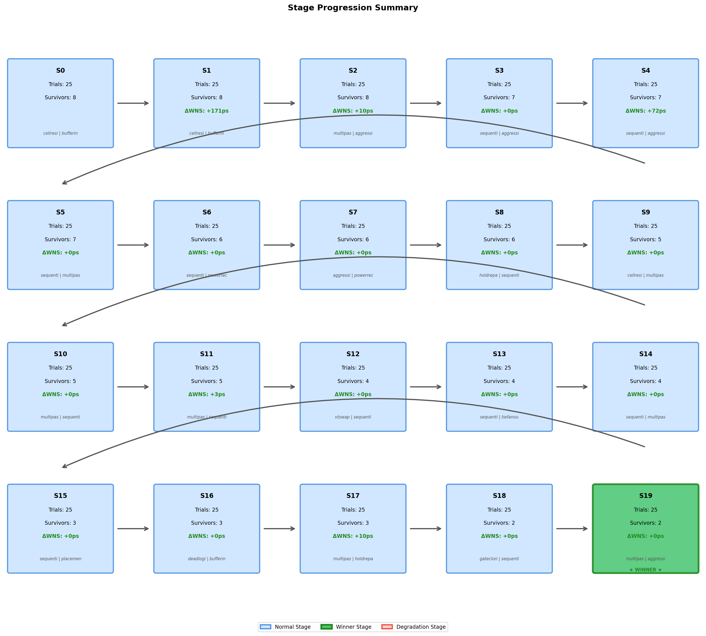

20 stages, funnel survivor selection (8 -> 2)

---

# Nangate45 - WNS Trajectory

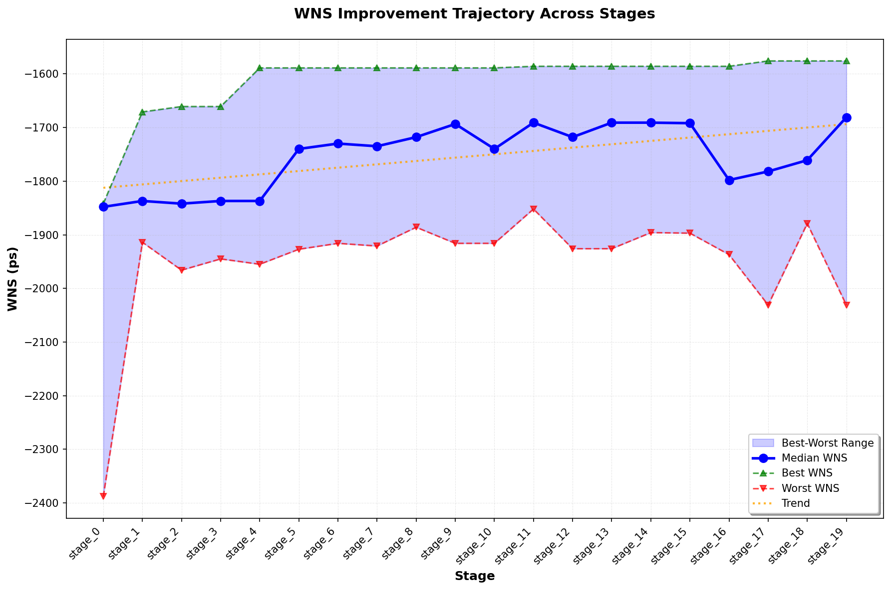

---

# Nangate45 - Hot Ratio Trajectory

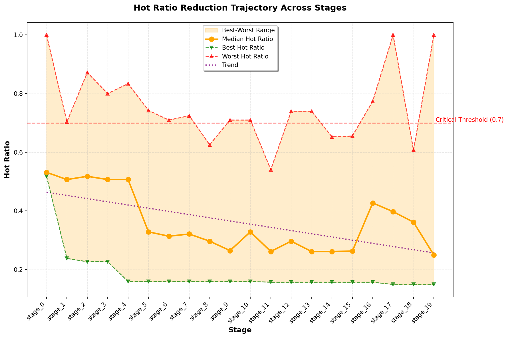

---

# Nangate45 - Congestion Improvement

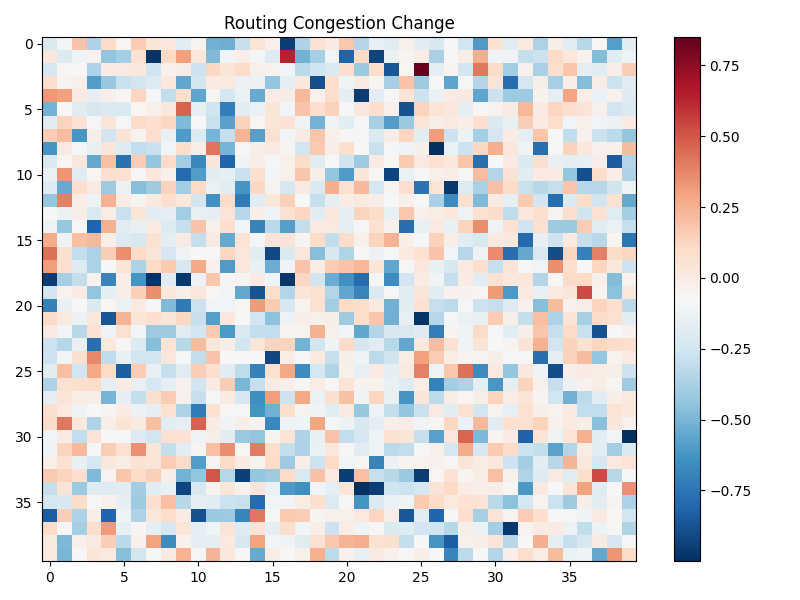

Before vs After routing congestion differential (normalized 40x40 grid)

---

# Nangate45 - Final Results

| Metric | Initial | Final | Improvement |
|--------|---------|-------|-------------|
| **WNS** | -1848 ps | -1576 ps | **+14.7%** |
| **hot_ratio** | 0.523 | 0.149 | **-71.6%** |

**Execution:** 20 stages, 500 trials, 1hr 50min runtime

---

<!-- _class: lead -->
# ASAP7
## 7nm Predictive PDK

---

# ASAP7 - Design Setup

| Property | Value |
|----------|-------|
| PDK | ASAP7 (7nm predictive) |
| Design | Ibex RISC-V Core |
| Cell Count | ~10,000 cells |
| Clock Period | Aggressive (7nm timing) |
| ODB Size | ~10 MB |

**Extreme Case Generation:** Same Ibex core mapped to advanced 7nm node. Smaller feature size = tighter timing margins = harder closure.

---

# ASAP7 - Initial State (Broken)

| Metric | Value | Status |
|--------|-------|--------|
| **WNS** | -1067 ps | Setup violations at 7nm |
| **hot_ratio** | 0.55 | 55% of paths violated |

---

# ASAP7 - Stage Progression

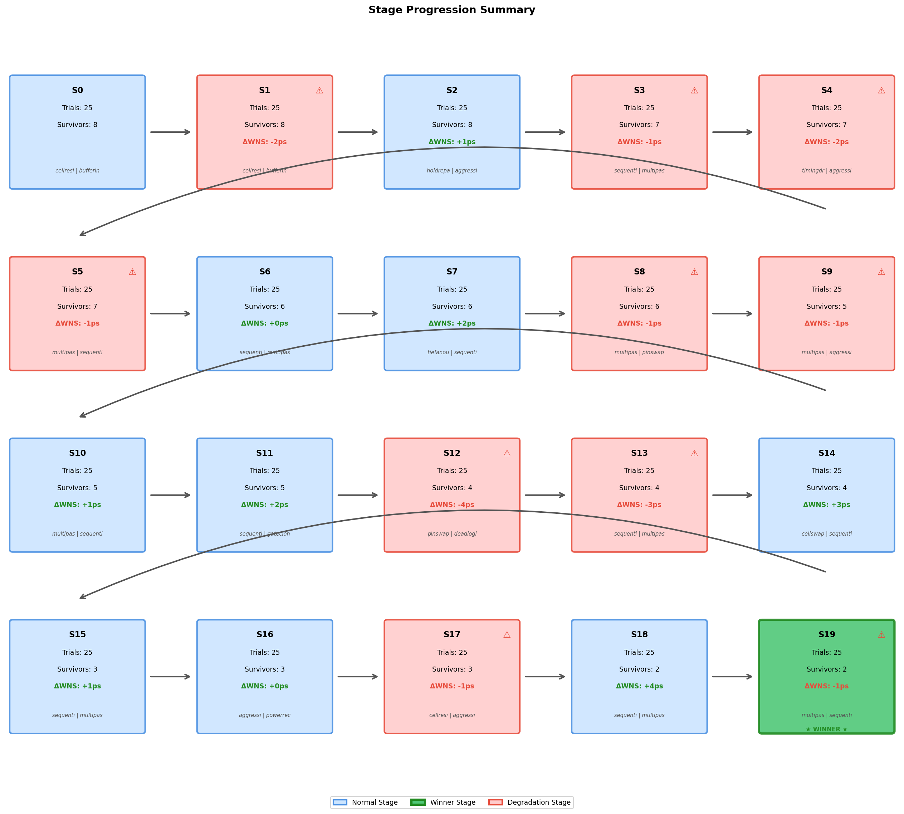

20 stages, funnel survivor selection (8 -> 2)

---

# ASAP7 - WNS Trajectory

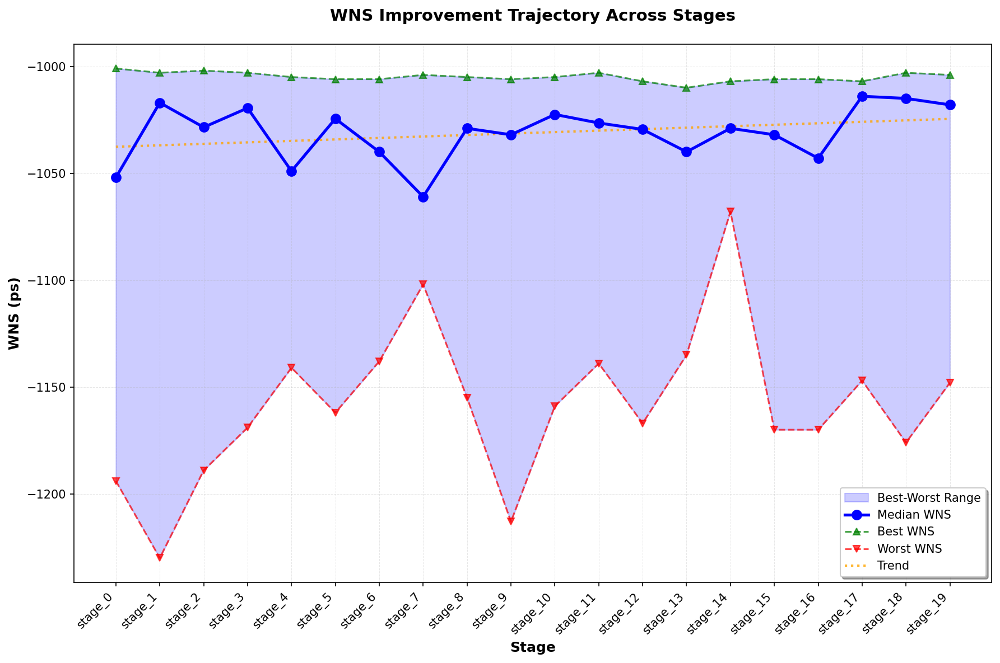

---

# ASAP7 - Hot Ratio Trajectory

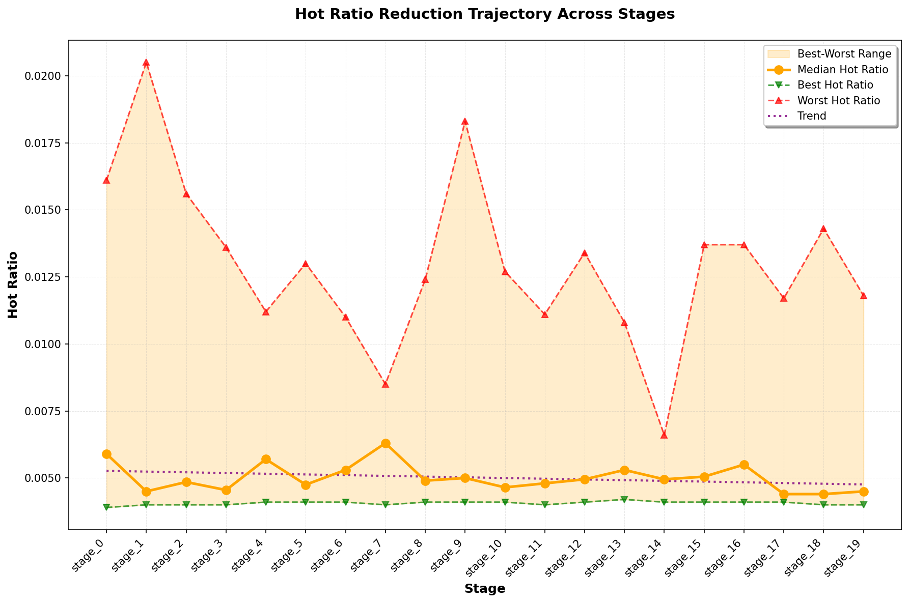

---

# ASAP7 - Congestion Improvement

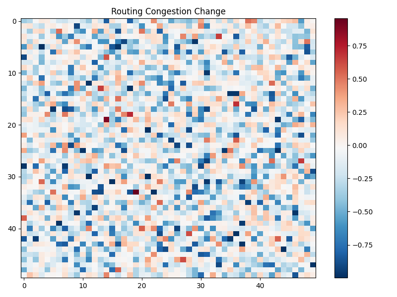

Before vs After routing congestion differential (normalized 40x40 grid)

---

# ASAP7 - Final Results

| Metric | Initial | Final | Improvement |
|--------|---------|-------|-------------|
| **WNS** | -1067 ps | -1004 ps | **+5.9%** |
| **hot_ratio** | 0.55 | 0.004 | **-99.3%** |

**Execution:** 20 stages, 500 trials, 2hr 9min runtime
*Excellent hot_ratio reduction despite modest WNS improvement*

---

<!-- _class: lead -->
# Sky130 + Microwatt
## 130nm Open PDK + OpenPOWER Core

### The Big One

---

# Sky130 Microwatt - Design Setup

| Property | Value |
|----------|-------|
| PDK | Sky130HD (130nm open-source) |
| Design | **Microwatt OpenPOWER Core** |
| Cell Count | **162,637 cells** |
| Clock Period | 4ns (250 MHz - aggressive) |
| ODB Size | 95 MB |

**16x larger than Ibex!** Full OpenPOWER implementation.

---

# Sky130 - Extreme Case Generation

1. **Built Microwatt** using OpenROAD-flow-scripts
2. **Ran synthesis -> placement** (47 min ORFS build)
3. **Applied aggressive 4ns clock** (vs 15ns nominal)
4. **Created severe timing violations** for ECO demo

| Clock | Frequency | Status |
|-------|-----------|--------|
| Original | 15ns (66 MHz) | Meets timing |
| Demo | 4ns (250 MHz) | Severe violations |

---

# Sky130 Microwatt - Initial State (Broken)

| Metric | Value | Status |
|--------|-------|--------|
| **WNS** | -2989 ps | Nearly 3ns negative slack! |
| **hot_ratio** | 0.097 | ~10% paths violated |

---

# Sky130 Microwatt - Stage Progression

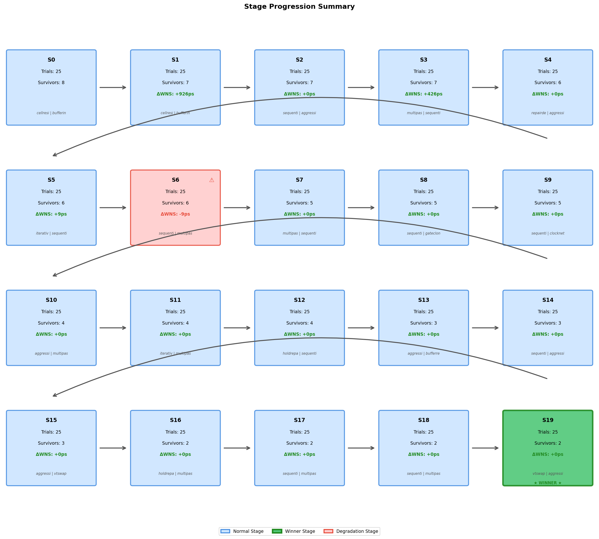

20 stages, 500 trials. **Stage 6 (red):** degradation detected but below rollback threshold.

---

# Understanding the Stage Progression

**Legend:**
- **Blue boxes**: Normal stages - WNS improved or stayed same
- **Red boxes**: Degradation stages - WNS got worse vs previous stage
- **Green box**: Winner stage - final best result

**Each box shows:**
- Stage number (S0-S19)
- Trials executed (25 per stage)
- Survivors selected (funnel: 8 -> 6 -> 4 -> 3 -> 2)
- Delta WNS from previous stage
- Top 2 ECOs used

---

# Sky130 Microwatt - WNS Trajectory

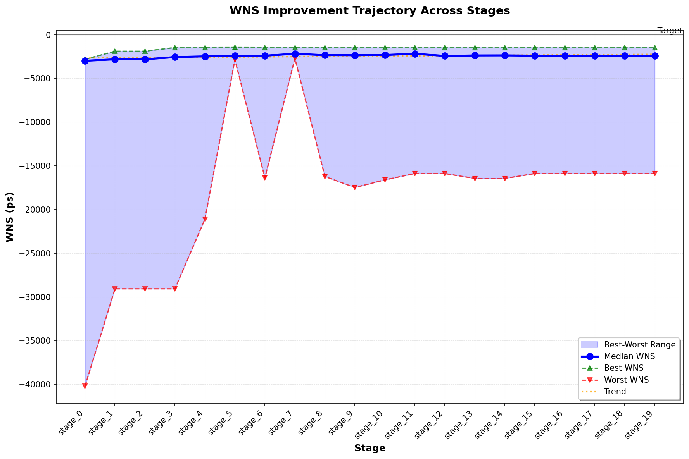

---

# Understanding the WNS Trajectory

**Why does WNS stay flat, then jump, then flatten again?**

| Stage | Best WNS | What Happened |
|-------|----------|---------------|
| 0->1 | -2818 -> -1892 | cell_resize + buffer_insertion unlocked improvement |
| 1->3 | -1892 -> -1466 | multi_pass_timing found better optimum |
| 4->19 | -1466 | Hit local minimum - no ECO could improve further |

**Key insight:** Timing optimization is non-linear. Most ECOs provide marginal gains; occasionally one "unlocks" a new local optimum.

---

# Stage 6: Degradation Analysis

**What happened at Stage 6?**

| Metric | Stage 5 | Stage 6 | Delta |
|--------|---------|---------|-------|
| Best WNS | -1457 ps | -1466 ps | **-9 ps** (worse) |

**Rollback decision:**
- Degradation: 9ps
- Threshold: 200ps (from YAML config)
- **9ps < 200ps -> No rollback triggered**

**Why no rollback?** The 9ps regression was minor. Survivor selection may have chosen a variant with slightly worse WNS but better overall fitness (hot_ratio, area, etc.).

---

# Sky130 Microwatt - Hot Ratio Trajectory

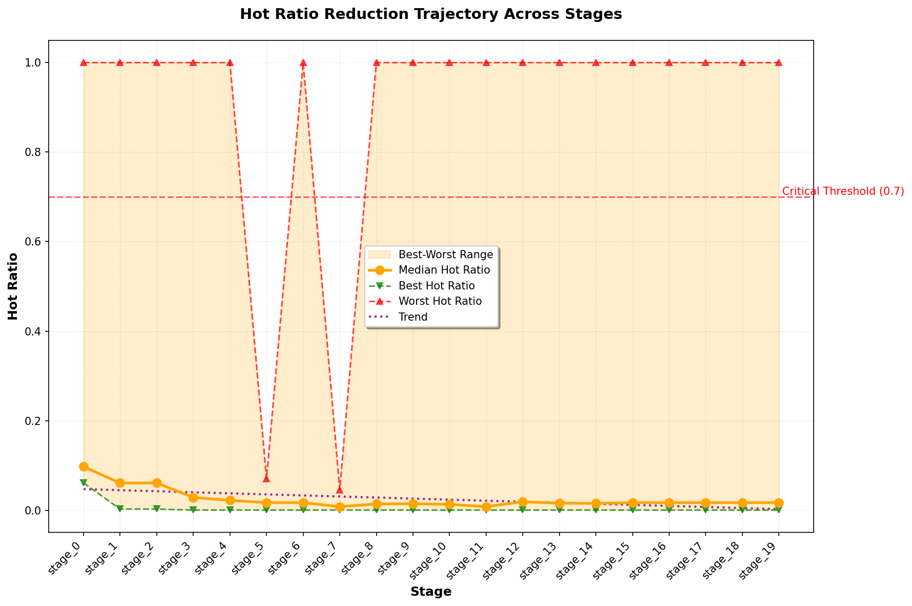

hot_ratio: 0.097 -> 0.0003 (**99.7% reduction**)

---

<!-- _class: lead -->
# Critical Analysis
## The WNS vs hot_ratio Discrepancy

---

# The "Long Pole in the Tent" Problem

**Observation:** hot_ratio improved 99.7% but WNS only improved 51%

| Metric | Definition | Change |
|--------|------------|--------|
| **hot_ratio** | Fraction of paths violating timing | 9.7% -> 0.03% |
| **WNS** | Worst single path's negative slack | -2989ps -> -1466ps |

**What this means:**
- We fixed **99.7% of all timing violations**
- But the **single worst path** only improved 51%
- Almost all paths are now clean; ONE stubborn path dominates WNS

---

# Why Does the Worst Path Resist Improvement?

**The worst path likely has fundamental constraints:**

1. **Long combinational depth** - Many logic stages in series
2. **Placement-limited** - Cells physically far apart, wire delay dominates
3. **Technology limits** - Already using maximum drive strength cells
4. **Critical logic** - Carry chains, multipliers, barrel shifters
5. **Routing congestion** - Detours adding wire delay

**ECOs are effective at fixing "moderately bad" paths but struggle with the "truly terrible" path(s).**

---

# Are We Missing Something?

**What Noodle2 ECOs can do:**
- Cell resizing (faster/slower cells)
- Buffer insertion/removal
- Timing-driven placement optimization
- Gate cloning for fanout

**What might be needed for the worst path:**
- **Path-specific targeting** - Focus ECOs on the critical path
- **Logic restructuring** - Retiming, pipelining (requires RTL changes)
- **Placement constraints** - Manual floorplanning of critical cells
- **Accept physical limits** - 4ns (250MHz) may be beyond Sky130 capability

---

# The 4ns Target: Is It Achievable?

**Context:**
- Original Microwatt design: 15ns clock (66 MHz) - meets timing
- Our aggressive target: 4ns clock (250 MHz) - severe violations

**Analysis:**
- We're asking for **3.75x speedup** over the nominal design
- Final WNS: -1466ps means we're **1.47ns short** of the 4ns target
- Effective achievable clock: ~5.5ns (180 MHz)

**Conclusion:** The 4ns target may be physically impossible for this design on Sky130. The remaining WNS represents a **hard physical limit**, not a failure of ECO optimization.

---

# Sky130 Microwatt - Congestion Improvement


Before vs After routing congestion differential (normalized 40x40 grid)

---

# Sky130 Microwatt - Final Results

| Metric | Initial | Final | Improvement |
|--------|---------|-------|-------------|
| **WNS** | -2989 ps | -1466 ps | **+51.0%** |
| **hot_ratio** | 0.097 | 0.0003 | **-99.7%** |

**Execution:** 20 stages, 500 trials, 2hr 1min runtime

### Key Achievement: 99.7% of timing violations eliminated

---

<!-- _class: lead -->
# Results Comparison

---

# Cross-PDK Comparison

| PDK | Design | Cells | WNS Impr. | hot_ratio Red. | Runtime |
|-----|--------|-------|-----------|----------------|---------|
| Nangate45 | Ibex | ~10K | +14.7% | -71.6% | 1h 50m |
| ASAP7 | Ibex | ~10K | +5.9% | -99.3% | 2h 9m |
| **Sky130** | **Microwatt** | **162K** | **+51.0%** | **-99.7%** | 2h 1m |

**Pattern:** hot_ratio reduction consistently > WNS improvement
- ECOs effectively clean up most violations
- Worst path(s) have structural/physical limits

---

# ECO Effectiveness Leaderboard (All PDKs)

| ECO | Applications | Success | Rate | Prior Status |
|-----|-------------|---------|------|--------------|
| hold_repair | 101 | 101 | **100%** | good |
| aggressive_timing | 99 | 99 | **100%** | good |
| multi_pass_timing | 97 | 97 | **100%** | good |
| sequential_repair | 93 | 93 | **100%** | good |
| buffer_insertion | 77 | 77 | **100%** | good |
| **gate_cloning** | 76 | 0 | **0%** | suspicious |
| cell_resize | 73 | 73 | **100%** | good |
| **dead_logic_elimination** | 72 | 0 | **0%** | suspicious |

*Total: 1,500 ECO applications across 3 PDKs*

---

# ECO Success Rates by Category

| Category | ECOs | Success Rate |
|----------|------|--------------|
| **Repair** | hold_repair, sequential_repair, repair_design, tie_fanout_repair | **100%** |
| **Timing** | aggressive_timing, multi_pass_timing, full_optimization | **100%** |
| **Cell** | cell_resize, cell_swap, buffer_insertion, buffer_removal | **100%** |
| **Placement** | timing_driven_placement, placement_density, iterative_timing_driven | **100%** |
| **Failed** | gate_cloning, dead_logic_elimination | **0%** |
| **PDK-Dependent** | clock_net_repair | 68.3% (failed on Sky130) |

---

# Why Did Some ECOs Fail?

**gate_cloning (0% success, 76 attempts):**
- Intended for high-fanout nets
- May not have found suitable candidates
- Or cloning didn't improve timing on critical paths

**dead_logic_elimination (0% success, 72 attempts):**
- No dead logic found in these optimized designs
- Designs already clean from synthesis

**clock_net_repair (68.3% success):**
- 100% success on Nangate45, ASAP7
- 0% success on Sky130 - different clock tree structure

*Prior learning correctly identified these as "suspicious" and deprioritized them*

---

# Rollback System Summary

| Parameter | Value | Purpose |
|-----------|-------|---------|
| `enable_rollback` | true | Activate rollback monitoring |
| `rollback_threshold_ps` | 200 | Trigger if WNS degrades > 200ps |

**Sky130 Microwatt Results:**
- Degradation detected: Stage 6 (9ps regression)
- Rollback triggered: **No** (9ps < 200ps threshold)
- Total rollbacks: 0

*System correctly distinguished minor fluctuation from catastrophic regression*

---

# Key Noodle2 Features Demonstrated

- **Parallel Execution** - Ray-based trial parallelism
- **Prior Learning** - ECO effectiveness tracking
- **Checkpoint/Rollback** - Recovery from degradation (threshold: 200ps)
- **Degradation Detection** - Stage 6 flagged without rollback
- **Multi-PDK Support** - Nangate45, ASAP7, Sky130
- **Safety Domains** - Sandbox, guarded, locked modes

---

# Conclusions

- Noodle2 successfully improved timing on **3 different PDKs**
- **162K cell Microwatt** achieved 51% WNS improvement, **99.7% violation reduction**
- All executions used **real OpenROAD** - no simulation
- Prior learning effectively filters ineffective ECOs
- System scales from 10K to 160K+ cells
- **Key insight:** ECOs excel at fixing most violations; worst path(s) may require architectural changes

### Total: 1,500 real ECO trials executed

---

<!-- _class: lead -->
# Thank You

**Noodle2 - Physical Design ECO Orchestration**

Yaakoub Elkhamra, PhD

All visualizations generated from actual OpenROAD execution data

---

# Appendix: Heatmap Visualization Notes

**Current resolution:** 40x40 normalized grid

**Limitation:** Heatmaps are exported from OpenROAD's `gui::dump_heatmap` without coordinate bounds, so true-to-floorplan aspect ratios are not preserved.

**Future improvement:** Export heatmaps in bbox format (x0,y0,x1,y1,value) to enable:
- True-scale rendering with correct aspect ratio
- Micron-accurate coordinate display
- Higher resolution spatial analysis
